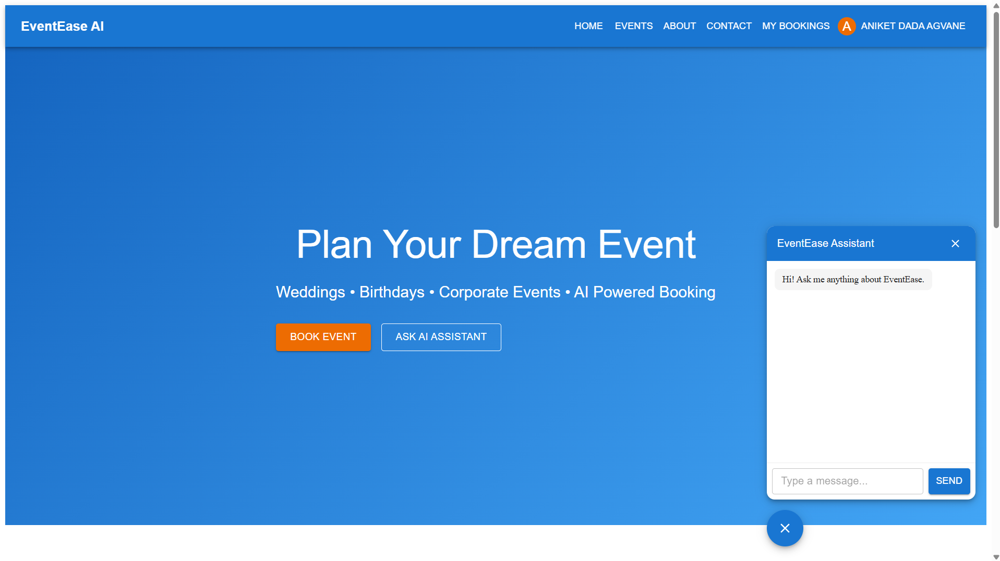
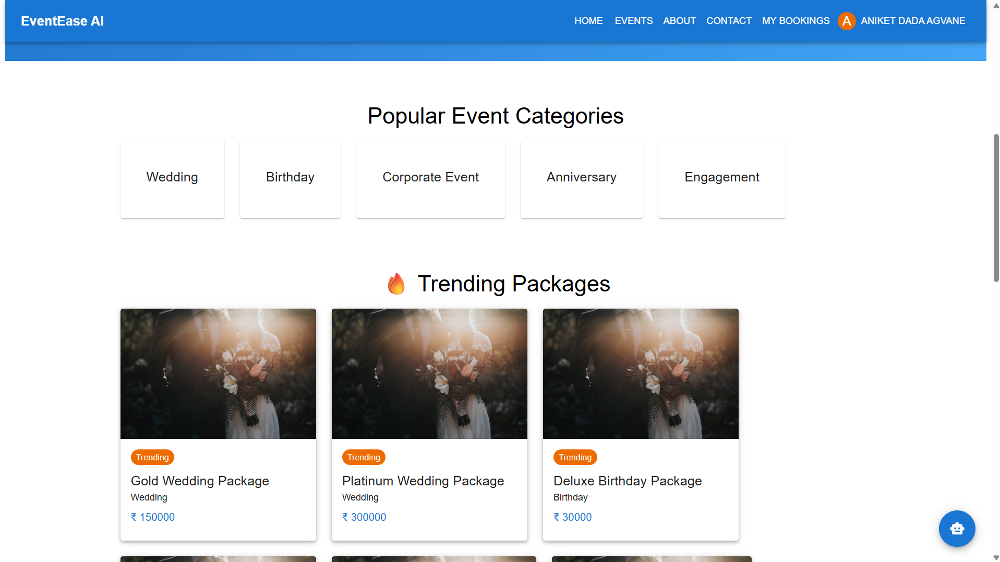
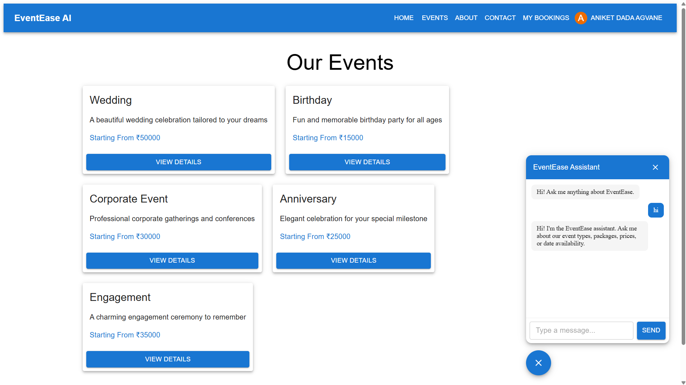
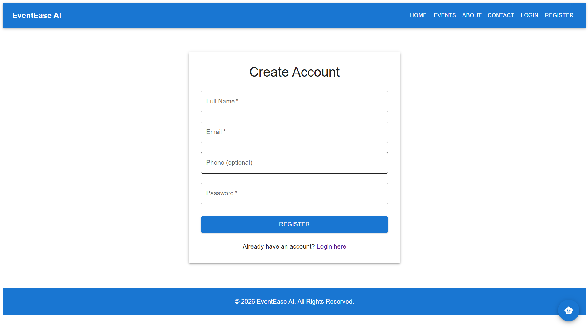

# 🎉 EventEase AI

**AI-powered event discovery, planning, and booking platform.**

EventEase AI is a modern event management platform that helps users discover events, explore event packages, search for suitable options, register and log in, manage their profile, and interact with an integrated AI Assistant for event-related guidance.

The project is split into a **React/Vite frontend** and an **ASP.NET Core Web API backend**.

---

## 🔗 Project Links

| Resource | Link |
|---|---|
| Frontend Repo | [eventease-client](https://github.com/aniketagvane3232/eventease-client) |
| Backend Repo | [eventease-server](https://github.com/aniketagvane3232/eventease-server) |
| Live App | [eventease-client.vercel.app](https://eventease-client.vercel.app/) |

---

## ✨ Features

- 🎉 **Event Discovery** — browse available events and event categories
- 📦 **Event Packages** — explore event packages and services
- 🔎 **Event Search** — find relevant events and packages
- 🤖 **AI Assistant** — get help with event-related questions and planning
- 👤 **Authentication** — sign up and log in securely
- 📅 **Event Booking** — select and book events
- 📋 **Booking Management** — view and manage your bookings
- 🙋 **Profile Management** — manage user profile information
- 📱 **Responsive UI** — works across desktop, tablet, and mobile
- 🔄 **Frontend/Backend Integration** — React frontend communicates with the ASP.NET Core API

---

## 🛠️ Tech Stack

**Frontend**
- React
- Vite
- JavaScript
- Material UI
- React Router
- Axios
- CSS

**Backend**
- ASP.NET Core Web API
- C# / .NET
- Entity Framework Core
- REST APIs
- JWT Authentication

**Database**
- Relational database via Entity Framework Core

---

## 🏗️ Architecture

```
                    ┌──────────────────────┐
                    │         USER          │
                    └──────────┬────────────┘
                               │
                               ▼
                    ┌──────────────────────┐
                    │   React + Vite        │
                    │   Frontend (MUI)      │
                    └──────────┬────────────┘
                               │
                         Axios / REST
                               │
                               ▼
                    ┌──────────────────────┐
                    │   ASP.NET Core API    │
                    │      Backend          │
                    └──────────┬────────────┘
                               │
                 ┌─────────────┼─────────────┐
                 ▼             ▼             ▼
           ┌──────────┐  ┌──────────┐  ┌──────────────┐
           │  Users   │  │  Events  │  │   Bookings   │
           └──────────┘  └──────────┘  └──────────────┘
                               │
                               ▼
                        ┌───────────┐
                        │ Database  │
                        └───────────┘
```

### Main Components

| Component | Responsibility |
|---|---|
| React + Vite | User interface and client-side application |
| Material UI | Interface components and styling |
| Axios | HTTP communication with the backend |
| ASP.NET Core API | Authentication, business logic, and REST endpoints |
| Entity Framework Core | Database access |
| Database | Persistent application data |
| JWT | Authentication and authorization |
| AI Assistant | Event-related AI assistance |

---

## 📸 Screenshots

<p align="center">
  
  <br><em>🏠 Home Page</em>
</p>

<p align="center">
  
  <br><em>🎉 Event Discovery</em>
</p>

<p align="center">
  
  <br><em>📅 Events</em>
</p>

<p align="center">
  
  <br><em>📝 Registration</em>
</p>

---

## 🚀 Getting Started

### Prerequisites

- Node.js and npm
- .NET SDK
- A database server
- Git

### 1. Clone the Frontend

```bash
git clone https://github.com/aniketagvane3232/eventease-client.git
cd eventease-client
```

### 2. Install Frontend Dependencies

```bash
npm install
```

### 3. Configure the Frontend

Create a `.env` file in the project root and point it at your backend API:

```env
VITE_API_URL=http://localhost:5000
```

### 4. Start the Frontend

```bash
npm run dev
```

Open the local Vite URL shown in your terminal (usually `http://localhost:5173`).

---

## ⚙️ Backend Setup

The backend is maintained in a separate repository: [eventease-server](https://github.com/aniketagvane3232/eventease-server)

```bash
git clone https://github.com/aniketagvane3232/eventease-server.git
cd eventease-server
dotnet restore
dotnet run
```

Configure the required database connection string and application settings in `appsettings.json` before running.

> ⚠️ **Important:** Never commit real database passwords, JWT secrets, or API keys to GitHub. Use environment variables or a local `appsettings.Development.json` (excluded via `.gitignore`) instead.

For full backend configuration and API implementation details, see the [backend repository](https://github.com/aniketagvane3232/eventease-server).

---

## 🔌 Request Flow

```
User
  │
  ▼
React + Vite UI (Material UI)
  │  Axios / REST
  ▼
ASP.NET Core API
  │
  ├──────────────┐
  ▼              ▼
Database   AI Assistant Services
```

---

## 📁 Project Structure

**Frontend**

```
eventease-client/
├── assets/
│   ├── event.png
│   ├── home.png
│   ├── home_1.png
│   └── register.png
├── public/
├── src/
├── package.json
├── vite.config.js
└── README.md
```

**Backend**

```
eventease-server/
├── server/
│   ├── Controllers/
│   ├── DTOs/
│   ├── Data/
│   ├── Migrations/
│   ├── Models/
│   ├── Properties/
│   ├── Program.cs
│   └── appsettings.json
├── server.slnx
└── README.md
```

> Both structures may evolve as the project grows.

---

## 🌐 Deployment

- **Frontend:** deployed on [Vercel](https://eventease-client.vercel.app/)
- **Backend:** maintained separately and deployable independently — see [eventease-server](https://github.com/aniketagvane3232/eventease-server)

---

## 🎯 Project Goals

EventEase AI was built to simplify event discovery and planning by combining event discovery, packages, search, AI-powered assistance, authentication, booking, and booking management into a single, responsive platform — instead of requiring users to hop between multiple services.

---

## 🤝 Contributing

Contributions and suggestions are welcome!

```bash
# Fork the repository
# Create a feature branch
git checkout -b feature/my-feature

# Make your changes
git add .
git commit -m "Add my feature"

# Push your branch
git push origin feature/my-feature
```

Then open a Pull Request on GitHub.

---

## 👨‍💻 Author

**Aniket Agvane**

- GitHub: [@aniketagvane3232](https://github.com/aniketagvane3232)
- Frontend: [eventease-client](https://github.com/aniketagvane3232/eventease-client)
- Backend: [eventease-server](https://github.com/aniketagvane3232/eventease-server)

---

## ⭐ Support

If you find EventEase AI useful, consider giving the repositories a ⭐ on GitHub — it helps a lot!

<p align="center"><strong>EventEase AI — Discover. Plan. Book. Celebrate.</strong></p>
